# Web-программирование. Лабараторная работа №1.

Работа выполнена студентом группы ИТб-5301 Митиковым В.О.

## Содержание
- [Web-программирование. Лабараторная работа №1.](#web-программирование-лабараторная-работа-1)
	- [Содержание](#содержание)
	- [Задание](#задание)
	- [Ход работы](#ход-работы)
		- [Веб-разработка](#веб-разработка)
		- [JavaScript](#javascript)
		- [TypeScript](#typescript)
	- [Вывод](#вывод)

## Задание
- Пройти интерактивный курс microsoft “Веб-разработка для начинающих”;
- Пройти интерактивный курс microsoft “Создание приложений JavaScript с помощью Node.js”;
- Пройти интерактивный курс microsoft “Создание приложений JavaScript с помощью TypeScript”.
## Ход работы  

### Веб-разработка  
Необходимо пройти интерактивный курс microsoft “Веб-разработка для начинающих”.  
Выполнение задания №1  
Необходимо выполнить 4 упражнения по работе с типами в javascript.  

Результат выполнения задания представлен ниже.  

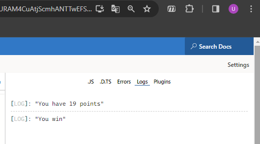  

Выполнение задания №2  
Необходимо выполнить задание по работе с итерфейсами в javascript.

Результат выполнения задания представлен ниже.  

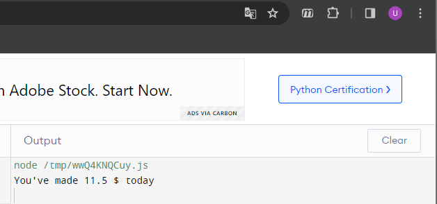  

Выполнение задания №3  
Необходимо выполнить задание по работе с массивами и объекатми в javascript.

Результат выполнения задания представлен ниже.  

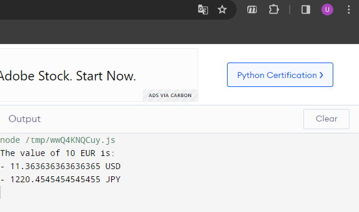  

Выполнение задания №4  
Необходимо выполнить задание по работе с функциями в javascript.

Результат выполнения задания представлен ниже.  

  
Отметка о результате прохождения курса представлена ниже  
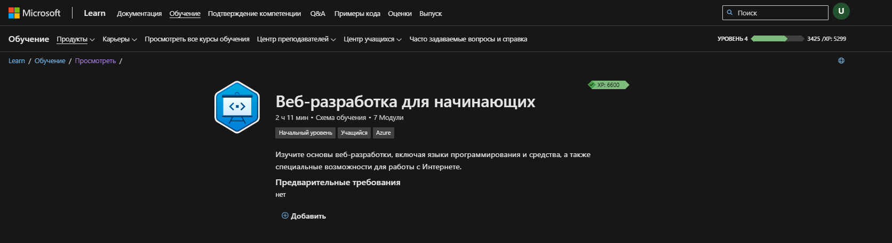  

### JavaScript
Необходимо пройти интерактивный курс microsoft “Создание приложений JavaScript с помощью Node.js”.
Выполнение задания №1  
Необходимо выполнить 4 упражнения по работе с файлами и каталогами в javascript.  

Результат выполнения задания представлен ниже.  

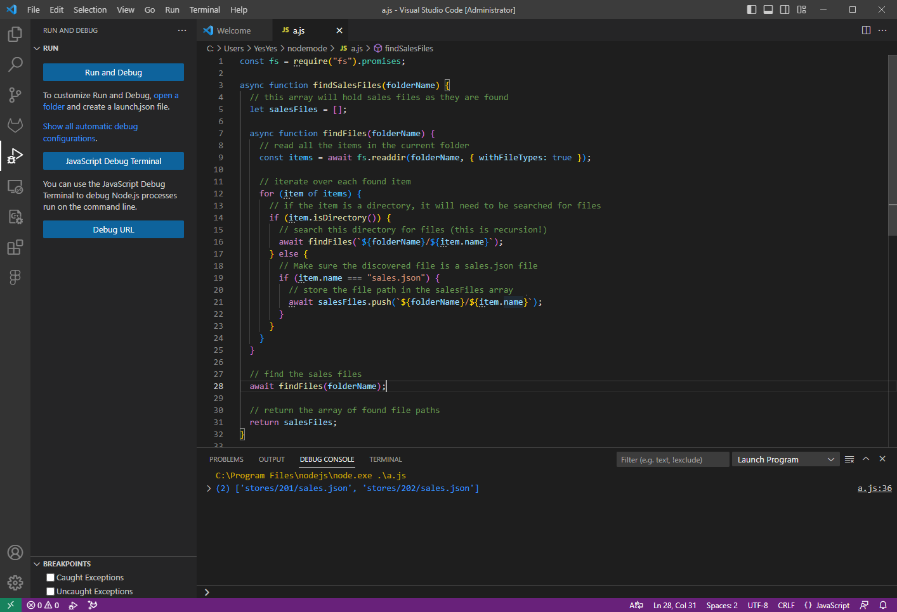  

Выполнение задания №2  
Необходимо выполнить задание по созданию веб-API в javascript.

Результат выполнения задания представлен ниже.  

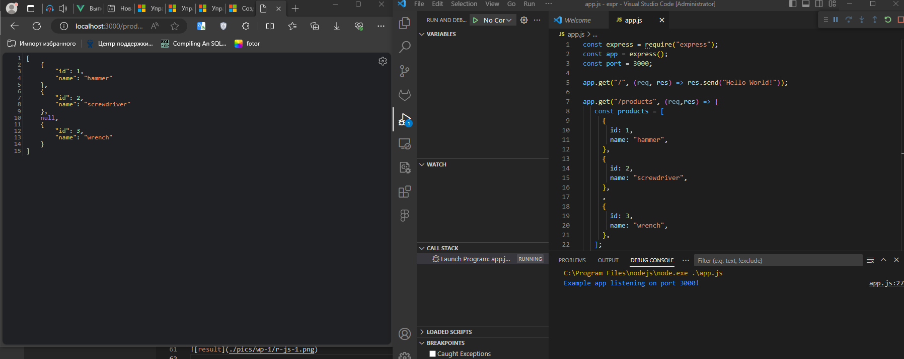  

Выполнение задания №3  
Необходимо выполнить задание по работе чтени. и записb данных в javascript.

Результат выполнения задания представлен ниже.  

  

Отметка о результате прохождения курса представлена ниже  
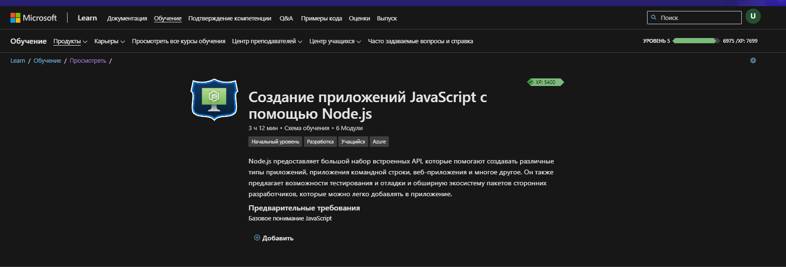

### TypeScript
Необходимо пройти интерактивный курс microsoft “Создание приложений JavaScript с помощью TypeScript”.
Выполнение задания №1  
Необходимо выполнить 4 упражнения по работе с типами в typescript.  

Результат выполнения задания представлен ниже.  

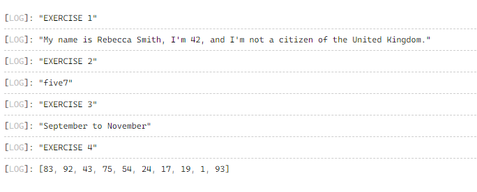  

Выполнение задания №2  
Необходимо выполнить задание по работе с итерфейсами в typescript.

Результат выполнения задания представлен ниже.  

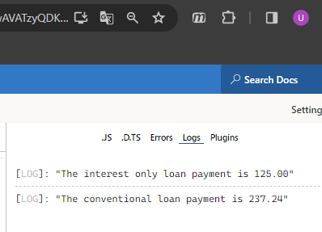  

Выполнение задания №3  
Необходимо выполнить задание по работе с типизированными функциями в typescript.

Результат выполнения задания представлен ниже.  

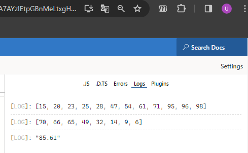  

Выполнение задания №4  
Необходимо выполнить задание по работе с классами в typescript.

Результат выполнения задания представлен ниже.  

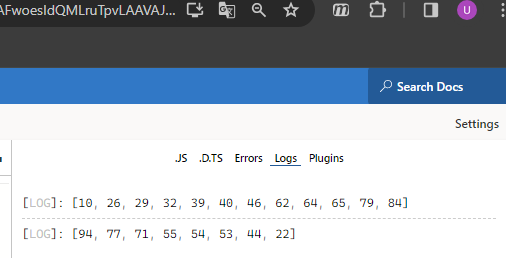  

Выполнение задания №5  
Необходимо выполнить задание по работе с шаблонами в typescript.
 
Результат выполнения задания представлен ниже.  

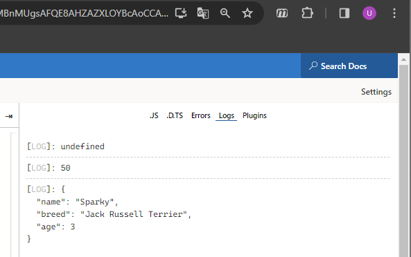  

Выполнение задания №6  
Необходимо выполнить задание по работе с модулями в typescript.

Результат выполнения задания представлен ниже.  

   

Выполнение задания №7  
Необходимо выполнить задание по работе с пространствами имен в typescript.

Результат выполнения задания представлен ниже.  

  

Отметка о результате прохождения курса представлена ниже.  
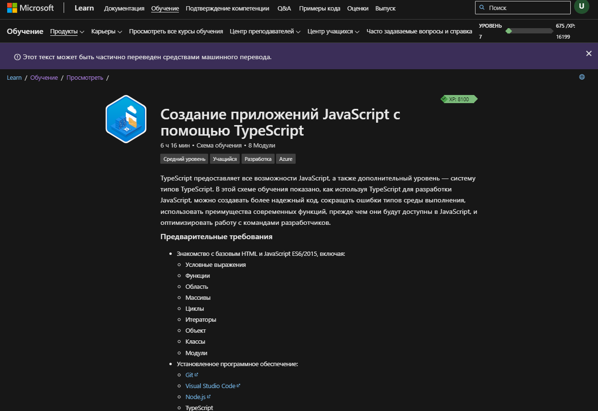
## Вывод
В ходе работы были изучен теоретический материал, пройдены интерактивные курсы.
