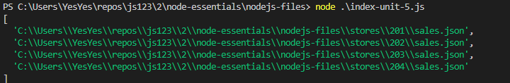

# Web-программирование. Лабараторная работа №1.

Работа выполнена студентом группы ИТб-5301 Митиковым В.О.

## Содержание
1. [Задание](#задание)
2. [Ход работы](#ход-работы)
	1. [Веб-разработка](#веб-разработка)
	2. [JavaScript](#javascript)
	3. [TypeScript](#typescript)
3. [Вывод](#вывод)

## Задание
- Пройти интерактивный курс microsoft “Веб-разработка для начинающих”;
- Пройти интерактивный курс microsoft “Создание приложений JavaScript с помощью Node.js”;
- Пройти интерактивный курс microsoft “Создание приложений JavaScript с помощью TypeScript”.
## Ход работы  

### Веб-разработка  
Необходимо пройти интерактивный курс microsoft “Веб-разработка для начинающих”.  
Выполнение задания №1  
Необходимо выполнить 4 упражнения по работе с типами в javascript.  

Результат выполнения задания представлен ниже.  

  

Выполнение задания №2  
Необходимо выполнить задание по работе с итерфейсами в javascript.

Результат выполнения задания представлен ниже.  

  

Выполнение задания №3  
Необходимо выполнить задание по работе с массивами и объекатми в javascript.

Результат выполнения задания представлен ниже.  

  

Выполнение задания №4  
Необходимо выполнить задание по работе с функциями в javascript.

Результат выполнения задания представлен ниже.  

  
Отметка о результате прохождения курса представлена ниже  
  

### JavaScript
Необходимо пройти интерактивный курс microsoft “Создание приложений JavaScript с помощью Node.js”.  

Выполнение задания №1  
Необходимо выполнить задание по управлению зависимостями.  
Результат выполнения задания представлен ниже.  
  

Выполнение задания №2  
Необходимо выполнить задание по управлению зависимостями.  
Результат выполнения задания представлен ниже.  
  

Выполнение задания №3  
Необходимо выполнить задание по управлению зависимостями и конфликтами.  
Результат выполнения задания представлен ниже.  
  

Выполнение задания №4  
Необходимо выполнить задание по работе с файлами.  
Результат выполнения задания представлен ниже.  
  

Выполнение задания №5  
Необходимо выполнить задание по работе с файлами.  
Результат выполнения задания представлен ниже.  
  

Выполнение задания №6  
Необходимо выполнить задание по работе с файлами и папками.  
Результат выполнения задания представлен ниже.  
  

Выполнение задания №7  
Необходимо выполнить задание по созданию файлов.  
Результат выполнения задания представлен ниже.  
  

Выполнение задания №8  
Необходимо выполнить задание по созданию и перезаписи файлов.  
Результат выполнения задания представлен ниже.  
  

Выполнение задания №9  
Необходимо выполнить задание по работе с отладчиком node.  
Результат выполнения задания представлен ниже.  
  

Выполнение задания №10  
Необходимо выполнить задание по по работе с отладчиком редактора кода.  
Результат выполнения задания представлен ниже.  
  

Выполнение задания №11  
Необходимо выполнить задание по работе с express.  
Результат выполнения задания представлен ниже.  
  

Выполнение задания №12  
Необходимо выполнить задание по работе с express.  
Результат выполнения задания представлен ниже.  
  

Выполнение задания №13  
Необходимо выполнить задание по раутингу.  
Результат выполнения задания представлен ниже.  
  

Отметка о результате прохождения курса представлена ниже  
  

### TypeScript
Необходимо пройти интерактивный курс microsoft “Создание приложений JavaScript с помощью TypeScript”.
Выполнение задания №1  
Необходимо выполнить 4 упражнения по работе с типами в typescript.  

Результат выполнения задания представлен ниже.  

  

Выполнение задания №2  
Необходимо выполнить задание по работе с итерфейсами в typescript.

Результат выполнения задания представлен ниже.  

  

Выполнение задания №3  
Необходимо выполнить задание по работе с типизированными функциями в typescript.

Результат выполнения задания представлен ниже.  

  

Выполнение задания №4  
Необходимо выполнить задание по работе с классами в typescript.

Результат выполнения задания представлен ниже.  

  

Выполнение задания №5  
Необходимо выполнить задание по работе с шаблонами в typescript.
 
Результат выполнения задания представлен ниже.  

  

Выполнение задания №6  
Необходимо выполнить задание по работе с модулями в typescript.

Результат выполнения задания представлен ниже.  

  

Выполнение задания №7  
Необходимо выполнить задание по работе с пространствами имен в typescript.

Результат выполнения задания представлен ниже.  

  

Выполнение задания №8  
Необходимо выполнить задание по работе с пространствами имен в typescript.

Результат выполнения задания представлен ниже.  

  

Выполнение задания №9  
Необходимо выполнить задание по работе с пространствами имен в typescript.

Результат выполнения задания представлен ниже.  

  

Отметка о результате прохождения курса представлена ниже.  

## Вывод
В ходе работы были изучен теоретический материал, пройдены интерактивные курсы.
