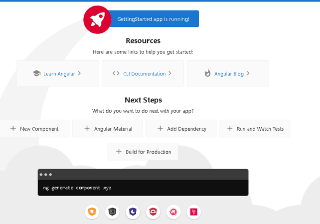
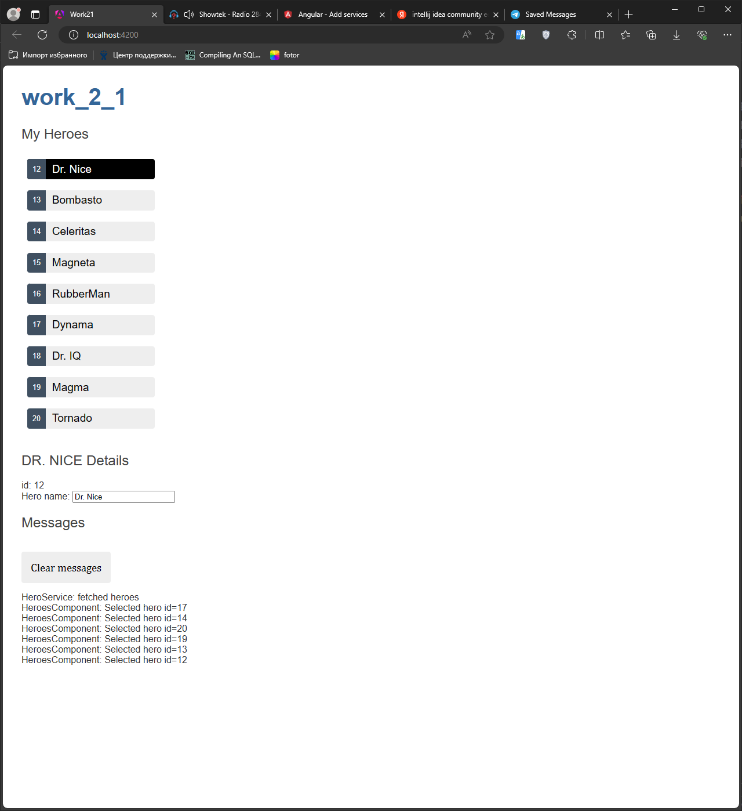
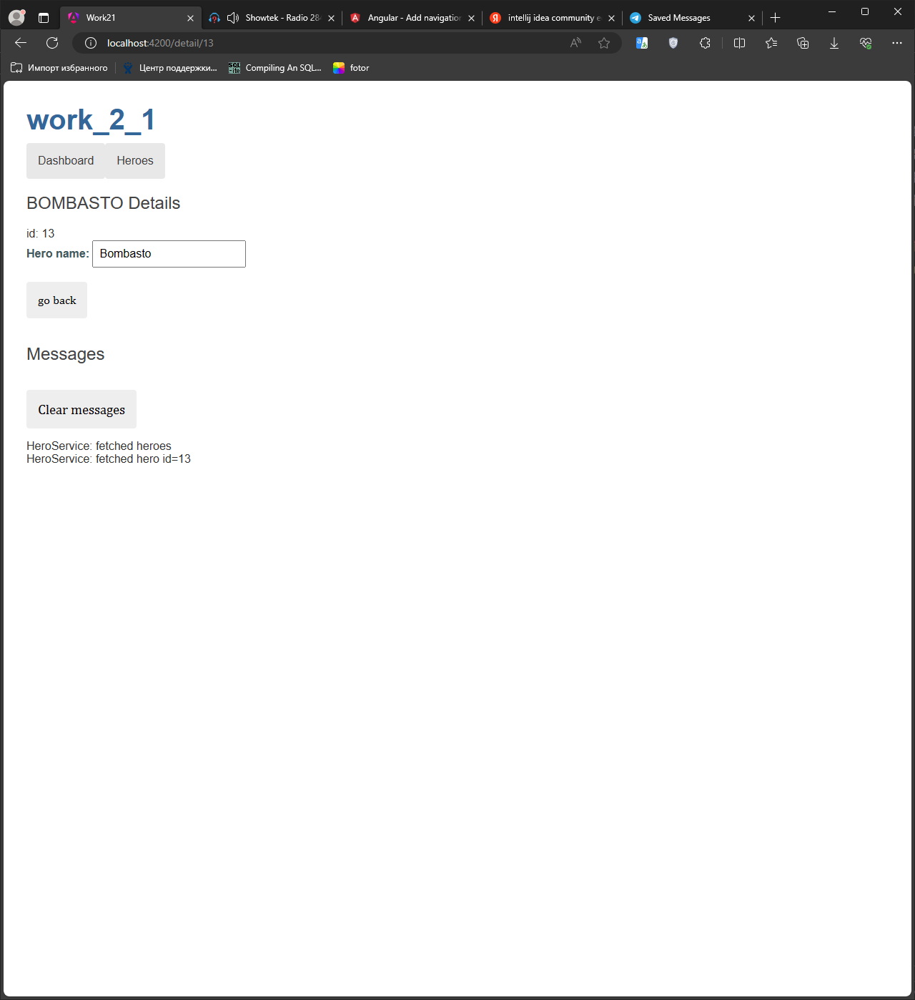
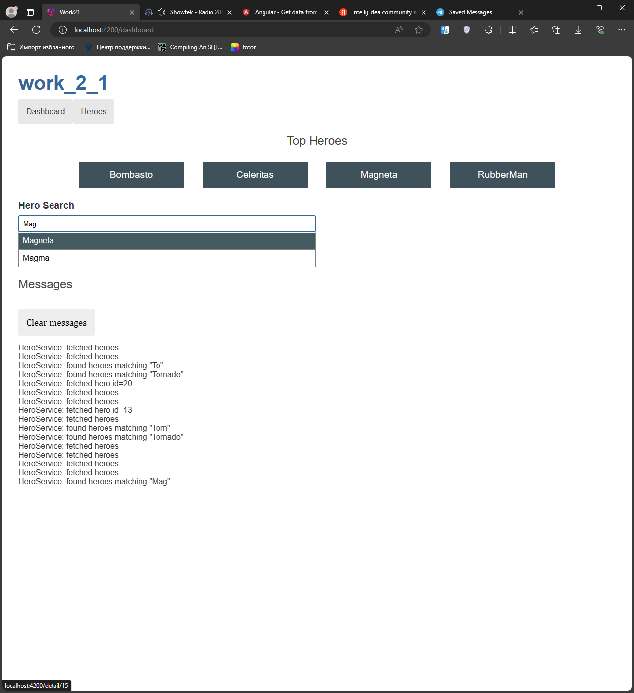
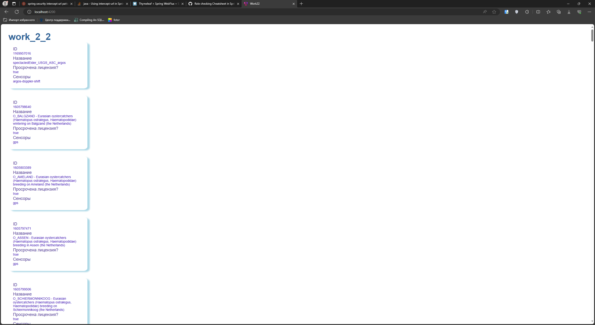

# Web-программирование. Лабораторная работа №2. Вариант № 2

Работа выполнена студентом группы ИТб-5301 Митиковым В.О.

## Содержание
- [Web-программирование. Лабораторная работа №2. Вариант № 2](#web-программирование-Лабораторная-работа-2-вариант--2)
	- [Содержание](#содержание)
	- [Задание](#задание)
	- [Ход работы](#ход-работы)
		- [Обучающее приложение](#обучающее-приложение)
		- [Приложение по варианту](#приложение-по-варианту)
	- [Вывод](#вывод)

## Задание
- Реализовать обучающее приложение;
- Разработать приложение по варианту.   
## Ход работы  

### Обучающее приложение  
    
Для начала работы необходимо создать новый проект vue с помощью команды `ng new --no-standalone`  
Протестировать работу приложения можно с помощью команд `ng serve`. Результат запуска приложения представлен ниже.  
  
Следуя инструкции необходимо выполнить следующее: 
- Создать класс сущности Hero;
- Создать компоненты hero, hero-details и dashboard и настроить их представление;
- Настроить систему раутинга в программе;
- Создать и настроить сервис hero-service;

Отображение результата работы программы представлено ниже.
  
  
  

### Приложение по варианту
В соответствии с вариантом задания необходимо реализовать приложение по выводу списка сущностей в виде карточек. API для приложения по варианту:  
`https://github.com/movebank/movebank-api-doc`  
Для работы приложения необходимо реализовать следующие компоненты системы:
- Класс Study;
- Компонент Studies;
- Сервис Study-service;
После реализации всех компонентов системы необходимо установить связь с API, для этого реализованы метод:
```ts
//studies.service.ts
  private api_token = '3012aafc-e72f-4b5a-9da7-bf5454aef49e';
  private baseURL = 'https://www.movebank.org/movebank/service';
  private studiesUrl = `${this.baseURL}/public/json?entity_type=study&i_can_see_data=true&api-token=${this.api_token}`; 
  /** GET heroes from the server */
  getStudies(): Observable<Study[]> {
    return this.http.get<Study[]>(this.studiesUrl);
  }
```
Использованный метод возвращает в json формате список исследований с их базовой информацией.
Результат работы приложение можно увидеть ниже.
  

## Вывод
В ходе работы были изучен теоретический материал, реализовано обучающее приложение и приложение по варианту.
