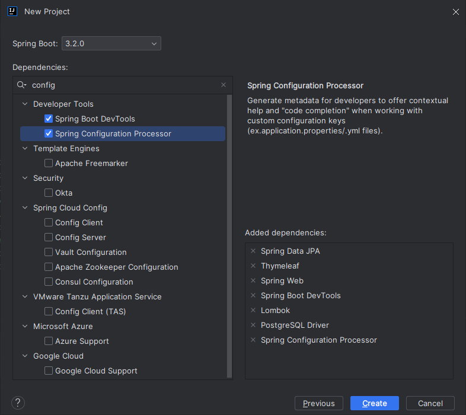
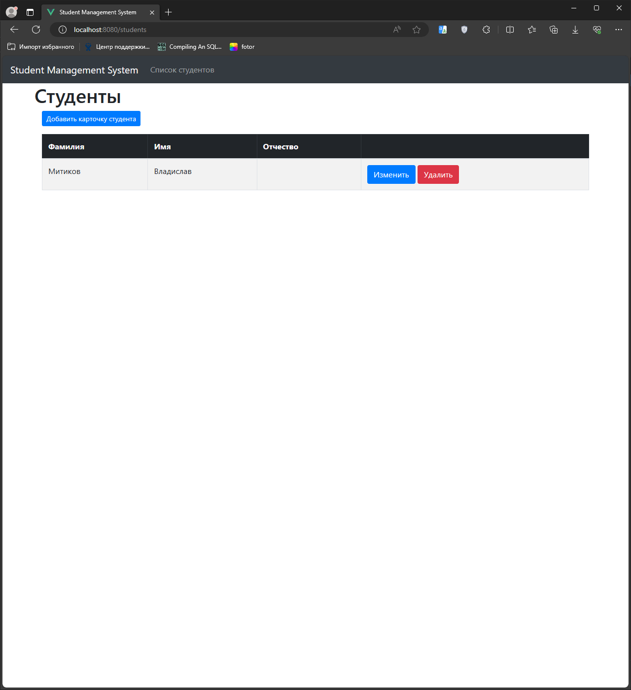
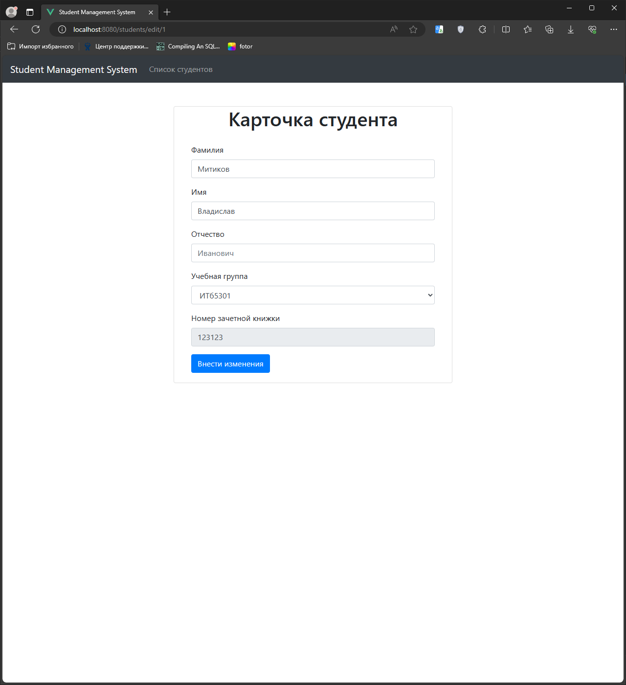
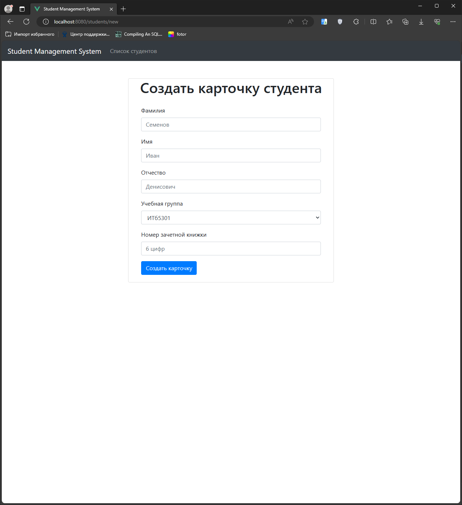
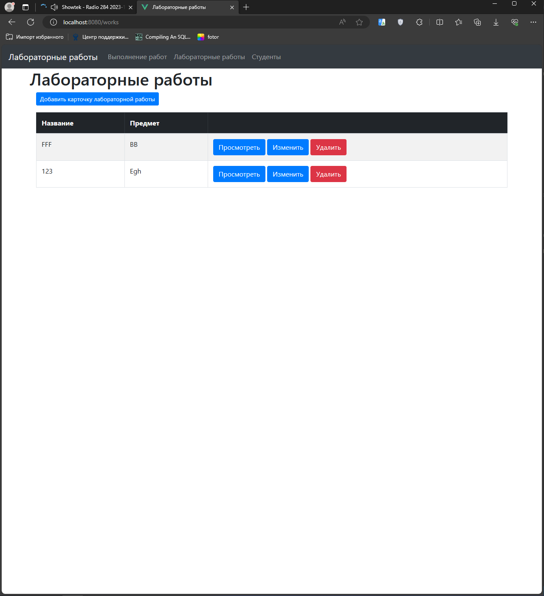
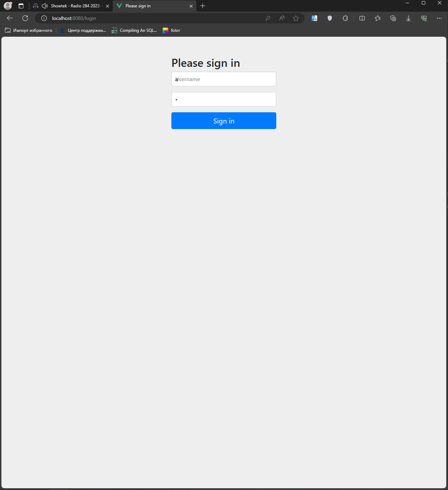
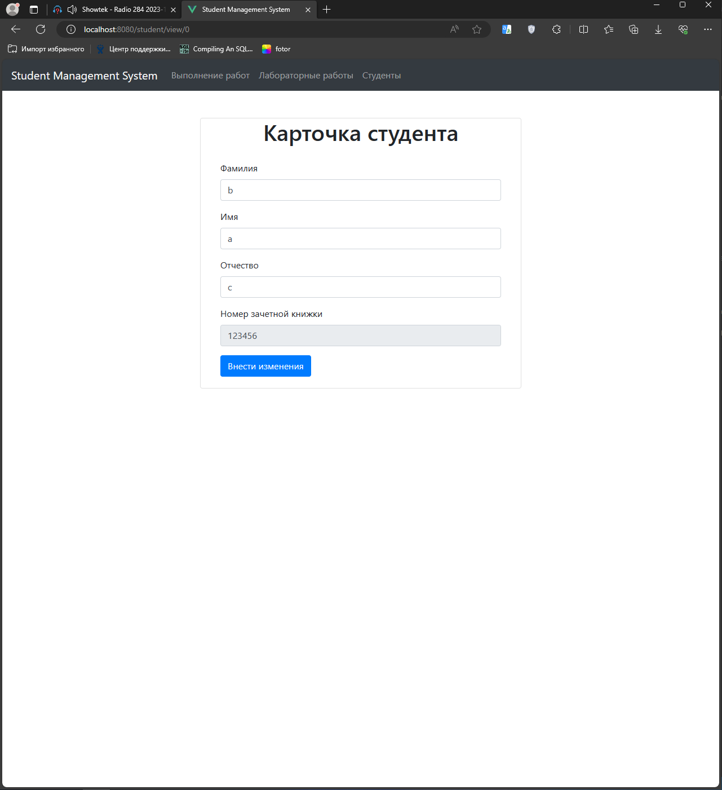
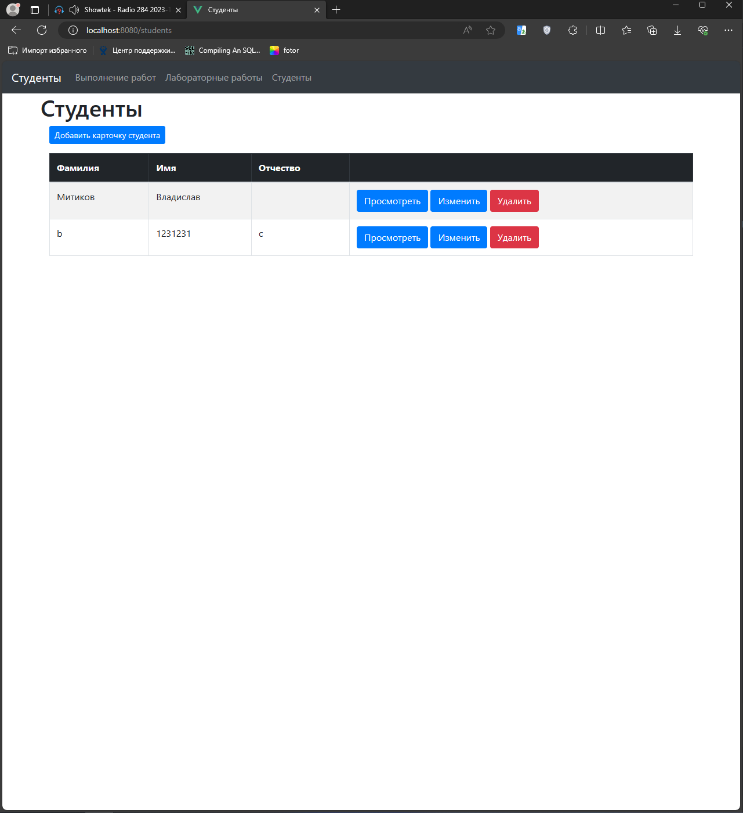
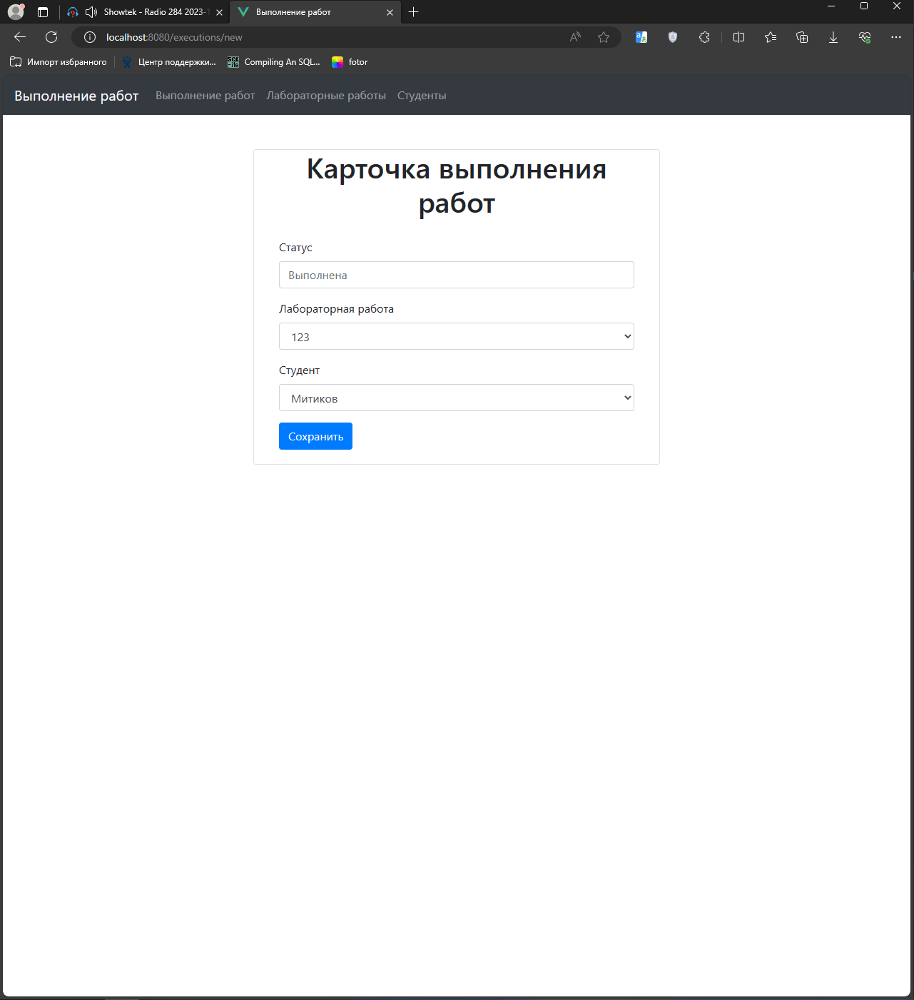
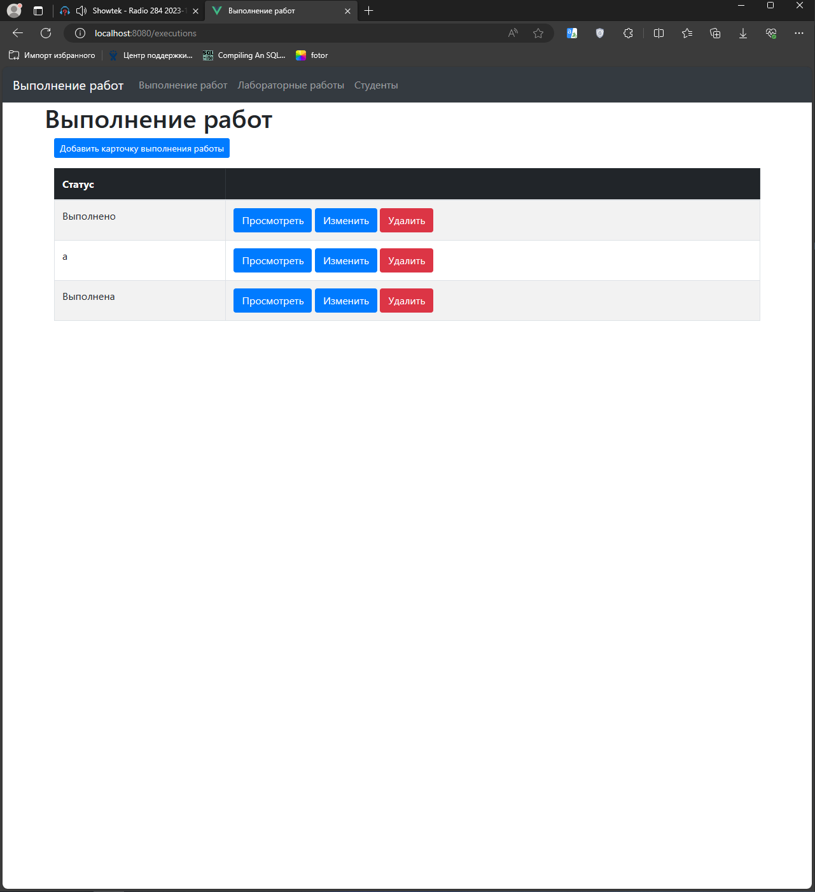

# Web-программирование. Лабораторная работа №3. Вариант № 2

Работа выполнена студентом группы ИТб-5301 Митиковым В.О.

## Содержание
- [Web-программирование. Лабораторная работа №3. Вариант № 2](#web-программирование-Лабораторная-работа-3-вариант--2)
	- [Содержание](#содержание)
	- [Задание](#задание)
	- [Ход работы](#ход-работы)
		- [Обучающее приложение](#обучающее-приложение)
		- [Приложение по варианту](#приложение-по-варианту)
	- [Вывод](#вывод)

## Задание
- Реализовать обучающее приложение;
- Разработать приложение по варианту.   
## Ход работы  

### Обучающее приложение  
    
Для начала работы необходимо создать новый проект spring boot с необходимыми зависимостями указанными ниже, также нужно установить postgresql.  
 
Следуя инструкции необходимо выполнить следующее: 
- Создать с помощью thymeleaf html шаблоны страниц;
- Создать контроллер StudyController;
- Создать сущности Study и Model;
- Создать репозитории этих сущностей;
- Создать сервисы и их реализации для этих сущностей.

Результат работы готового приложения представлен ниже.
  
  
  

### Приложение по варианту
В соответствии с вариантом задания необходимо реализовать приложение работы с 3 сущностями, связь между сущностями – звезда. Сущности по варианту:  
- Лабораторная работа;
- Выполнение работы;
- Студент.  
  
Для всех сущностей должен быть реализованы функции – краткое отображение списка экземпляров сущностей; полное отображение сущности; редактирование сущности; добавление новой сущности; жесткое или мягкое удаление сущности (по заданию).
Добавить разделение функционала на 2 роли: роль 1- редактирование любых сущностей, роль – 2 просмотр всех сущностей. Без идентификации возможен краткий просмотр сущностей.


Для каждой из сущностей по примеру обучающего приложения были реализованы классы моделей, сервисов и
контроллеров. Связи между таблицами установлены как `Студенты ManyToOne Выполнение OneToMany
Работы`.

Разделение функционала на роли реализовано с помощью spring security через базовую настройку
конфигурационного файла.
```xml
spring-security.xml

    <http auto-config="true" use-expressions="true">
        <intercept-url pattern="/login" access="permitAll" />
        <intercept-url pattern="/executions" access="permitAll" />
        <intercept-url pattern="/works" access="permitAll" />
        <intercept-url pattern="/students" access="permitAll" />
        <intercept-url pattern="/executions/{id}" access="hasRole('ROLE_ADMIN')" />
					<...>
        <intercept-url pattern="/execution/view/{id}" access="hasRole('ROLE_USER')" />
        <intercept-url pattern="/work/view/{id}" access="hasRole('ROLE_USER')" />
        <intercept-url pattern="/student/view/{id}" access="hasRole('ROLE_USER')" />
        <form-login default-target-url='/executions'/>
    </http>

    <authentication-manager>
        <authentication-provider>
            <user-service>
                <user name="u" password="{noop}u" authorities="ROLE_USER" />
                <user name="a" password="{noop}a" authorities="ROLE_USER, ROLE_ADMIN" />
            </user-service>
        </authentication-provider>
    </authentication-manager>
```

Результаты работы приложение можно увидеть ниже.

  
Список лабораторных работ  

  
Форма авторизации после попытки перейти к просмотру карточки  

  
Просмотр карточки студента  

  
Список студентов  

  
Карточка добавления элемента  

  
Результат добавления элемента  

## Вывод
В ходе работы были изучен теоретический материал, реализовано обучающее приложение и приложение по варианту.
